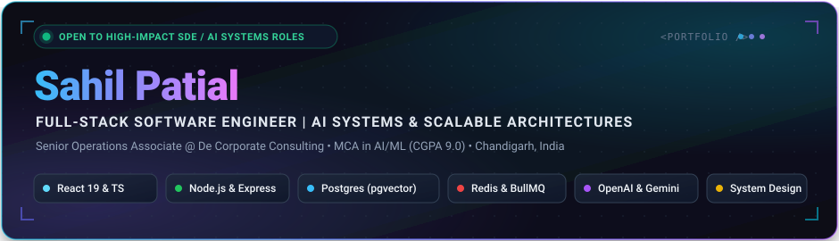

<!-- In-Repo Native Vector Banner (100% Uptime, No External Downtime) -->

 

<!-- Real-time Terminal Typing Animation with Modern Cyan Glow -->

  

<!-- Cohesive, High-Contrast Status & Contact Badges -->

&nbsp;

&nbsp;

&nbsp;

&nbsp;

---

## ⚡ About Me & Engineering Focus

> **Full-Stack Software Engineer** architecting **AI-integrated platforms, semantic search pipelines, and high-performance distributed web systems**. Experienced in taking systems end-to-end — from system architecture and schema design to high-throughput production deployment.

- 💼 **Senior Operations Associate @ De Corporate Consulting Pvt. Ltd.**  
  Architected an enterprise AI-powered client-job matching platform end-to-end (**React, TypeScript, Node.js/Express, PostgreSQL with `pgvector`, Elasticsearch, Redis/BullMQ**), pairing hybrid vector retrieval with an explainable scoring engine to rank and justify candidate-job compatibility.
- ⚙️ **Internal Tooling & High-Throughput Automation**  
  Engineered internal automation pipelines — a Chrome extension for LinkedIn data scraping, an automated email intelligence engine, and AI-agent workflows — adopted across a **30–40 person team** to drastically accelerate operational velocity.
- 👥 **Technical Leadership & Mentorship**  
  Led a 3-person database engineering team to architect corporate data pipelines (curating **1,000+ verified companies & 20,000+ verified contacts**), conducted daily code reviews, and mentored client-facing teams on technical workflows.
- 🎓 **Academics & Core CS**  
  Pursuing **Master of Computer Applications (MCA) in Artificial Intelligence & Machine Learning** at Chandigarh University (**CGPA: 9.0**), with a deep foundation in Data Structures & Algorithms, Distributed Systems, and System Design.

---

## 📊 Production Impact & Engineering Scorecard

| Metric | Focus Dimension | Production Architecture & Measurable Results |
| :---: | :---: | :--- |
| `⚡ < 200ms` | **API Latency** | Optimized Node.js/Express REST APIs with compound MongoDB indexing and query-level execution tuning |
| `🎯 92%` | **AI Matching Accuracy** | Compatibility scoring algorithm fusing OpenAI embeddings, ATS criteria, and semantic text evaluation |
| `🏢 20,000+` | **Verified Records** | Enterprise corporate database engineered from scratch across BFSI, GCCs, Tech, SaaS & VC |
| `🤖 500+ / day` | **Automated Ingestion** | Headless scraping pipeline (Selenium + BeautifulSoup) cutting candidate job search time by 70% |
| `👥 180+ / day` | **Recruitment Matches** | High-precision candidate-job matches surfaced daily in active 10-person pilot rollout |
| `🚀 35%` | **Frontend Speedup** | Client load reduction on React 18/19 via Redux code-splitting, lazy loading, and optimized bundle delivery |
| `🏆 Top Finalist` | **Hackathon Sprint** | Designed & deployed 2 full-stack web applications in 36 hours at National Re-Imagine Hackathon |

---

## 🚀 Featured Flagship Projects

<table>
  <tr>
    <td width="50%" valign="top">
      <h3 align="center">🤖 AI Resume Scoring &amp; Job Matching Engine</h3>
      

        <a href="https://github.com/Patial-45/AI_Based_Resume_Builder"><b>View Repository »</b></a>
      

      
A full-stack MERN &amp; AI platform that parses PDF/DOCX resumes, scores compatibility against job descriptions with <b>92% accuracy</b>, and delivers real-time ATS optimization.

      <ul>
        <li><b>Dual-LLM Engine:</b> OpenAI GPT-4 for semantic evaluation &amp; Groq (Llama 3.1) for instant query formulation and keyword suggestions.</li>
        <li><b>Automated Scraping:</b> Integrated Selenium &amp; BeautifulSoup pipeline harvesting 500+ targeted listings daily.</li>
        <li><b>Score Breakdown:</b> Granular telemetry measuring semantic match, skill coverage, and role progression fit.</li>
      </ul>
      

        
        
        
        
        
        
      

    </td>
    <td width="50%" valign="top">
      <h3 align="center">⚡ Enterprise AI Executive Search Platform</h3>
      

        <a href="https://github.com/Patial-45/executive-search-platform"><b>View Repository »</b></a>
      

      
Enterprise client-job matching platform combining vector search with an explainable scoring engine to match executive talent with requisitions.

      <ul>
        <li><b>Hybrid Vector Search:</b> Semantic vector retrieval via <code>PostgreSQL + pgvector</code> combined with full-text search in <code>Elasticsearch</code>.</li>
        <li><b>Distributed Task Queue:</b> Non-blocking background worker queue powered by <code>Redis + BullMQ</code> for asynchronous match evaluation.</li>
        <li><b>Production Pilot:</b> Currently driving a 10-person recruiter pilot processing 180+ daily matches.</li>
      </ul>
      

        
        
        
        
        
      

    </td>
  </tr>
  <tr>
    <td colspan="2" valign="top">
      <h3 align="center">💼 VectraWork — Precision Freelance &amp; Engineering Marketplace</h3>
      

        <a href="https://github.com/Patial-45/Online-Freelance-Platform"><b>View Repository »</b></a> • 
        <a href="https://online-freelance-platform-qh7l.vercel.app/"><b>Live Vercel Demo »</b></a>
      

      
Production-grade two-sided marketplace connecting enterprises with elite freelance engineers, backed by milestone escrow and 0% hidden fees.

      <ul>
        <li><b>Milestone Escrow &amp; Platform Hub:</b> Verified 3-stage milestone escrow simulator with instant funding states and proposal review.</li>
        <li><b>Dual-Mode Workspaces:</b> Dynamic switcher between Specialist/Freelancer profile and Client/Employer management dashboard.</li>
        <li><b>High-Performance Architecture:</b> Sub-200ms REST API response times, compound MongoDB indexing, Redux state management, and OWASP-hardened HTTP security headers.</li>
      </ul>
      

        
        
        
        
        
        
        
        
      

    </td>
  </tr>
</table>

---

## 🛠️ Technical Arsenal &amp; Ecosystem

#### 💻 Programming Languages

#### ⚛️ Frontend Engineering

- **Frameworks &amp; Libraries:** React 19, Redux / Redux Toolkit, TanStack Query, React Hook Form, Vite, Tailwind CSS, Material UI, HTML5 / CSS3

#### ⚙️ Backend &amp; API Architecture

- **Core Technologies:** Node.js, Express.js, RESTful APIs, Prisma ORM, BullMQ Task Queues, Zod Validation, JWT Auth, OAuth 2.0

#### 🗄️ Databases, Caching &amp; Vector Search

- **Storage Engines:** PostgreSQL (`pgvector`), MongoDB, Redis (Caching &amp; Queues), Elasticsearch (Full-text &amp; Analytics), MySQL

#### 🧠 Applied AI, LLMs &amp; Vector Systems
- **LLM APIs &amp; Models:** OpenAI API (GPT-4), Google Gemini API, Groq (Llama 3.1)
- **Architectures:** Semantic Vector Search, Embeddings Generation, Prompt Engineering, Retrieval-Augmented Generation (RAG) Concepts

#### ☁️ Cloud, DevOps &amp; Development Tooling

- **Infrastructure &amp; Tooling:** AWS, Google Cloud Platform (GCP), Docker, Nginx, Git, GitHub Actions (CI/CD), Postman, Linux, Vercel

#### 📐 Core Computer Science
- **Data Structures &amp; Algorithms:** Problem-solving in Java (Trees, Graphs, Dynamic Programming, Recursion, Complexity Analysis)
- **CS Fundamentals:** Object-Oriented Programming (OOP), Database Management Systems (DBMS), Operating Systems, Computer Networks, System Design

---

## 📜 Industry Accreditations &amp; Certifications

- 🏅 **Oracle Cloud Infrastructure 2025 Certified Generative AI Professional** — *Oracle*
- 🏅 **Oracle Data Science Professional** — *Oracle*
- 🏅 **Oracle DevOps Professional** — *Oracle*
- 🏅 **Prompt Design in Vertex AI** — *Google Cloud*
- 🏅 **McKinsey Forward Program** — *McKinsey &amp; Company*
- 🏅 **React JS Professional Certification** — *Infosys Springboard*
- 🏆 **National Finalist — Re-Imagine Web Development Hackathon** (*Sheryians Coding School, Sep 2024*) — Deployed 2 full-stack apps in a 36-hour sprint.

---

## 📊 GitHub Developer Activity

---

## 🤝 Connect &amp; Collaborate

I am always keen to connect and discuss **distributed web systems, Applied AI/LLM engineering, scalable full-stack products, and open-source software**.

  
  &nbsp;&nbsp;
  
  &nbsp;&nbsp;
  

  Engineered with precision by <a href="https://github.com/Patial-45"><b>Sahil Patial</b></a>. Powered by modern web architectures and applied AI.

